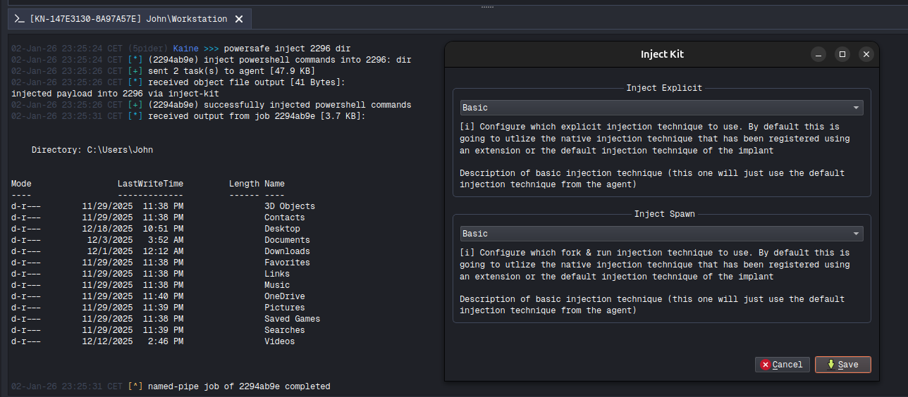

# inject-kit 

A small demonstration of utlizing custom beacon object files to perform fork & run and or explicit code injection. 

### NOTE
fork & run does currently not handle piped I/O, meaning that any kind of data that is written into stdout will be lost. 
Some post-ex features support specifying a pipe-name to communicate over instead of using process stdout/stdin.